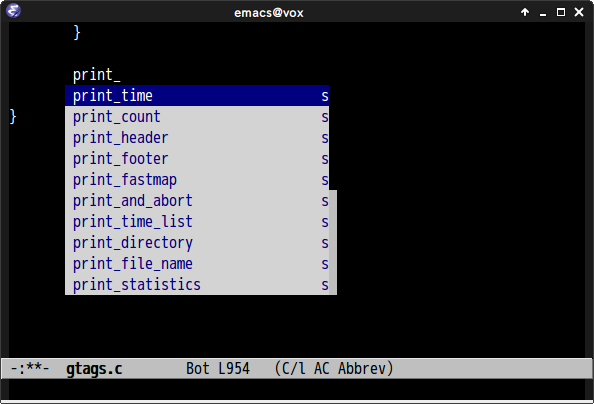

# ac-etags.el

## Introduction

`ac-etags.el` is etags/ctags completion source for [auto-complete](https://github.com/auto-complete/auto-complete).
You can use this package with etags/ctags of Emacs and [Exuberant Ctags](http://ctags.sourceforge.net/)


## Screenshot




## Installation

You can install `ac-etags.el` from [MELPA](http://melpa.milkbox.net/) with `package.el`

```
 M-x package-install ac-etags
```

## Requirements

- Emacs 23 or higher
- [auto-complete](https://github.com/auto-complete/auto-complete)


## Commands

#### `ac-etags-setup`

Setup auto-complete source for etags. This command must be called at the beginning.

#### `ac-etags-ac-setup`

Setup etags `auto-complete` source and enable `auto-complete-mode` if
`auto-complete` is not enabled.

## Customize Variables

#### `ac-etags-requires`(Default `3`)

Required number of characters of this source completion.
You should change this value before calling `ac-etags-setup`.

I recommend to use `custom-set-variable` for setting this value.


## Sample Configuration

```lisp
(custom-set-variable
  '(ac-etags-requires 1))

(eval-after-load "etags"
  '(progn
      (ac-etags-setup)))

(add-hook 'c-mode-common-hook 'ac-etags-ac-setup)
(add-hook 'ruby-mode-common-hook 'ac-etags-ac-setup)
```

## Usage

### First: Generate TAG file

```
 # Create TAG file with etags
 % etags *.c *.h

 # Create TAG file with Exuberant Ctags(You must specify '-e' option)
 % ctags -e *.c *.h
```

### Second: Set path of TAGS

Set path of TAG by `M-x visit-tags-table`

### Finally

You can completion with etags/ctags now.
